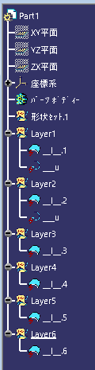
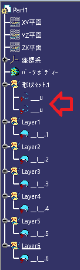
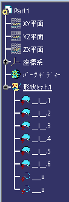

# ***CATIA V5 igs2cat groupbylayer***

本スクリプトは、Igesファイルをアイコンにドラッグ＆ドロップする事で、CATPartファイルに変換を行う為のものです。

---

## **これは何？**:

以下が特徴です。

+ Igesファイルをドラッグ＆ドロップする事でCATPartファイルに変換を行います。(複数のファイル可)
+ バッチモードでCATIA V5を起動させ変換処理を行う為、あなたの他の作業の邪魔をしません。
+ あなたが使用しているCATIA V5の環境に合わせて変換処理を行います。
+ レイヤー毎に形状セットを分けての変換します。

---

## **インストール**:

zipファイルをダウンロードし展開して下さい。

---

## **使用方法**:

最低限必要となるファイルは以下の2個となります。

+ Igs2Cat_GroupByLayer.vbs
+ Igs2Cat_Support.CATScript

#### - 準備 -

事前に、変換する為のCATIA V5の環境情報を取得する必要があります。

この作業は、1度だけ行えば大丈夫です。

※環境とは、リリース・ホットフィックスや、オプションの設定状態です。

+ CATIA V5を起動します。※複数起動している場合は、最初に起動した環境を取得します。
+ "Igs2Cat_GroupByLayer.vbs" をダブルクリックします。
+ 同一のフォルダ内に "Cat-Dll_Env-Path.txt" と言うファイルが出来上がれば終了です。

#### - 変換 -

"Igs2Cat_GroupByLayer.vbs" にIgesファイルをドラッグ＆ドロップしてください。

+ D&DされたIgesファイルと同一フォルダ内に、CATPartファイルが作成されます。
+ 複数ファイルD&Dされた場合、順番に変換します。
+ 拡張子 ".iges" のファイルの場合、".igs" への変更を確認するダイアログが出現します。
+ 変換後のファイル名が同一となってしまうファイルが存在する場合、"xxxx_1.CATPar"のようなナンバリング付きのファイル名となります。(上書き保存は行いません)
+ 変換後のCATPartファイルは、レイヤー毎に形状セットに分かれています。

---

## **変換後処理を変更する**:

本スクリプトは、CATIA V5をバッチ起動(画面の無い状態で起動)しCATScriptを実行し終了しています。

CATScriptを差し替えることで、変換後の処理を変更する事が可能です。

サンプルを "option" フォルダ内に入れております。各CATScriptを "Igs2Cat_Support.CATScript" に変更し、"Igs2Cat_GroupByLayer.vbs" と同一のフォルダ内に配置してD&Dして頂くと出来上がるCATPartが変わります。

#### - "Igs2Cat_Support_group-all.CATScript" -

現在はこのCATScriptの設定にしてあります。全ての要素をレイヤ毎に形状セットに分けています。

#### - "Igs2Cat_Support_group-suface-only.CATScript" -

サーフェスのみをレイヤ毎に形状セットに分け、点・線等の他の要素は一番上の形状セットに入れた状態になります。

#### - "Igs2Cat_Support_non-group.CATScript" -

通常の変換のみです。

---

## **複数環境で使用する**:

客先別で異なるリリースをインストールし運用している企業もあるかと思います。

仮に "R2018SP4" と "R2020SP4" を使用しているとします。

+ 予め環境用のフォルダを用意します。
    + "C:\sprict\r2018sp4" と "C:\sprict\r2020sp4" の様に
+ それぞれのフォルダに "Igs2Cat_GroupByLayer.vbs" "Igs2Cat_Support.CATScript" コピーペーストする。
+ 各フォルダに基づいたCATIA V5を起動し、"Igs2Cat_GroupByLayer.vbs" をダブルクリックし "Cat-Dll_Env-Path.txt" ファイルをそれぞれに作成する。
+ それぞれのフォルダの "Igs2Cat_GroupByLayer.vbs" のショートカットをデスクトップに作成し、ショートカットの名称を分かりやすいように変更する。

このそれぞれのショートカットへIgesファイルをD&Dする事で、環境に基づいた変換を行う事が可能です。

---

## **条件**:

- CATIA V5が起動可能なPC

---

## **アクション**:

以下の環境で確認済みです。

+ CATIA V5_6 R2018

+ Windows10 64bit Pro

---

## **ライセンス**:

- MIT